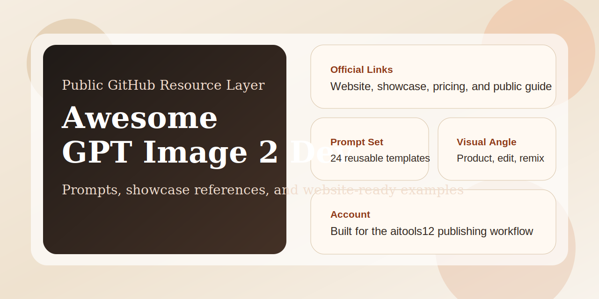
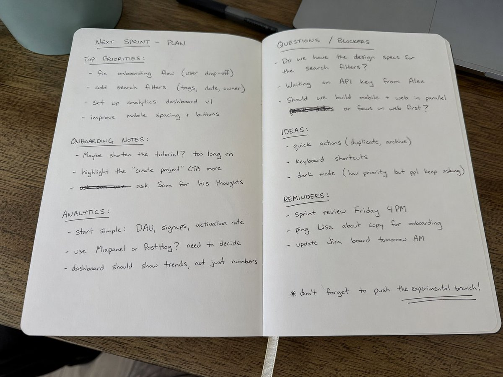
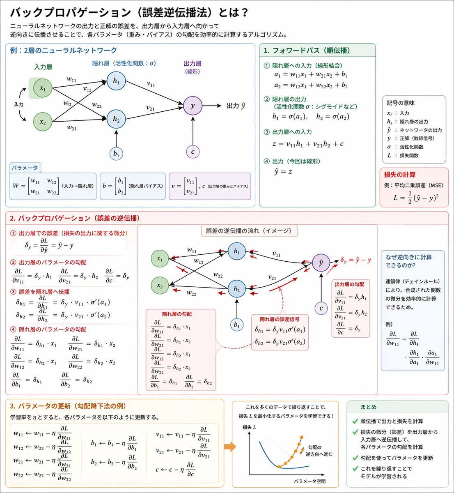
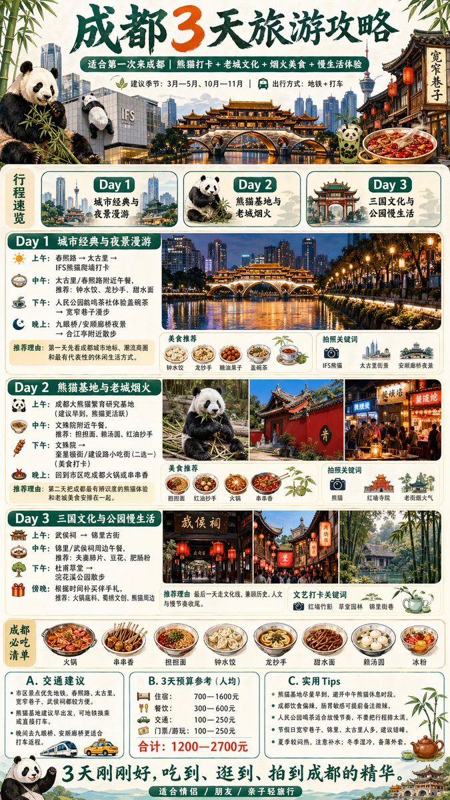
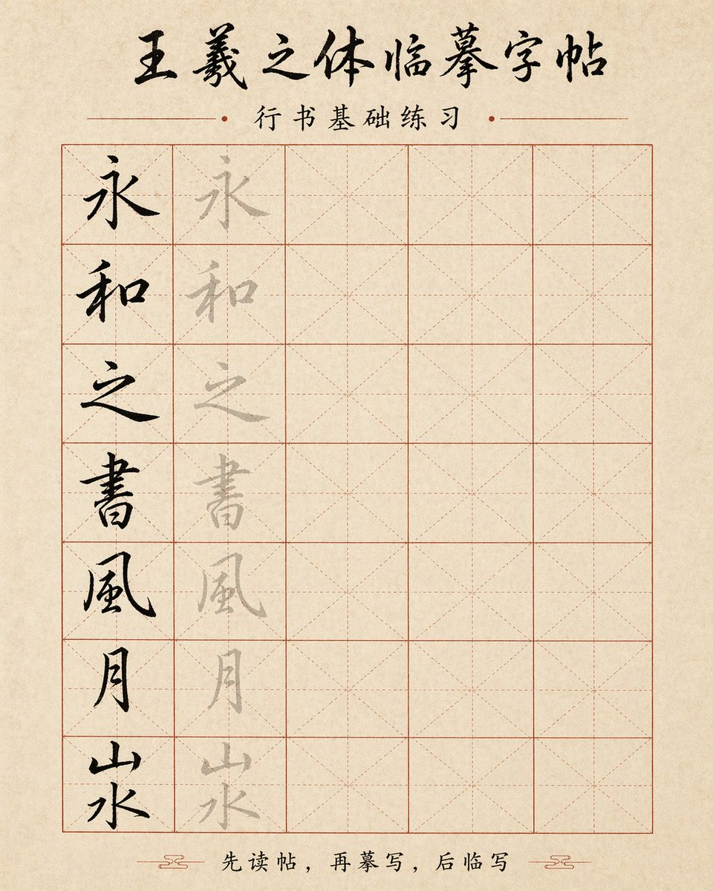
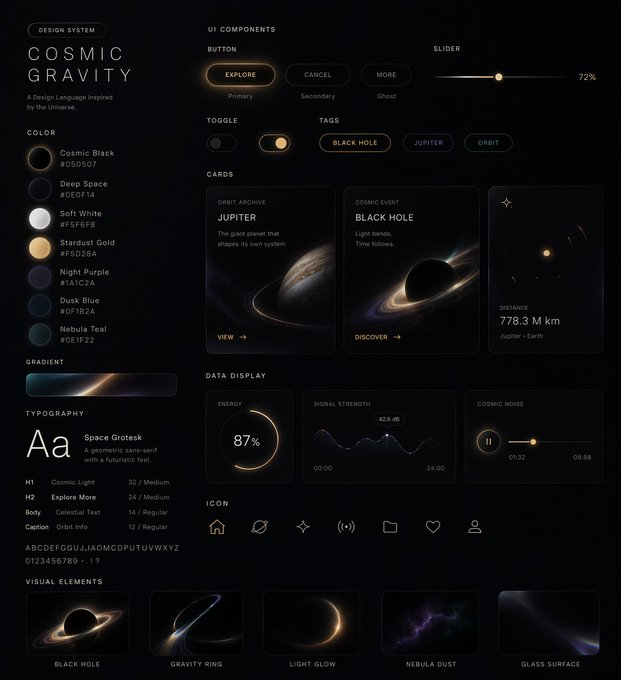

# Awesome GPT Image 2

[](https://www.gpt-image-2.dev/)
[](README.md)
[](README_zh-CN.md)

<p align="center">
  
</p>

> A source-attributed case library for GPT Image 2 style prompts, examples, and structured layouts.

This repository now keeps only cases with traceable origins. The earlier unsourced site-only examples were removed. Current images are either copied from the reference repositories you pointed to or documented with explicit upstream links.

## Quick Links

- Website: https://www.gpt-image-2.dev/
- Gallery: https://www.gpt-image-2.dev/showcase
- Pricing: https://www.gpt-image-2.dev/pricing
- GitHub repo: https://github.com/aitools12/awesome-gpt-image-2

## Repository Snapshot

| Metric | Value |
| --- | --- |
| Prompt templates | 24 |
| Source-attributed cases | 15 |
| Local reference images | 15 |
| Languages | English, Simplified Chinese |

Main files:

- [`data/gpt-image-2-dev-prompts.json`](data/gpt-image-2-dev-prompts.json)
- [`data/gpt-image-2-dev-cases.json`](data/gpt-image-2-dev-cases.json)
- [`PROMOTION.md`](PROMOTION.md)

## Case Library

### Documents and Infographics

#### 1. Handwritten Notebook Photo



```text
Amateur photo of an open notebook lying flat, filled with handwritten notes in black ballpoint pen. The handwriting is casual and slightly messy, with natural imperfections, crossed out words, underlined headings, natural daylight from a window, no flash, casual desk setting, shot on iPhone
```

Source:
- Repo: `ZeroLu/awesome-gpt-image`
- Original page: https://opennana.com/awesome-prompt-gallery/black-pen-handwritten-notes
- Attribution link: https://x.com/patrickassale/status/2044569086013718958

#### 2. Jingdezhen Blue-and-White Porcelain Diagram


```text
Create a museum-style educational infographic about Jingdezhen blue-and-white porcelain, with process steps, historical context, decorative motifs, labeled illustrations, and elegant editorial layout
```

Source:
- Repo: `ZeroLu/awesome-gpt-image`
- Original page: https://opennana.com/awesome-prompt-gallery/jingdezhen-blue-white-porcelain-diagram
- Attribution link: https://x.com/joshesye/status/2045764695827562686

#### 3. Ming Dynasty Hanfu Disassembly Infographic


```text
Generate a museum-level Chinese disassembly infographic explaining the structure, materials, meanings, and dressing order of Ming dynasty Hanfu, with annotated garment parts and refined editorial composition
```

Source:
- Repo: `ZeroLu/awesome-gpt-image`
- Original page: https://opennana.com/awesome-prompt-gallery/museum-level-chinese-disassembly-infographic
- Attribution link: https://x.com/MrLarus/status/2045504669401653414

#### 4. Backpropagation Diagram Poster



```text
Explain backpropagation in a clear educational poster with labeled neural network structure, forward pass, loss calculation, backward pass, gradients, and update steps
```

Source:
- Repo: `EvoLinkAI/awesome-gpt-image-2-prompts`
- Original post: https://x.com/itnavi2022/status/2046494262158930154
- Reference README anchor: `Case 43: Backpropagation Diagram Poster`

#### 5. Science Encyclopedia Infographic


```text
Generate a high-quality vertical encyclopedia infographic card for [topic], with one central visual, zoomed feature details, modular information blocks, concise labels, comparison cards, and collectible editorial design
```

Source:
- Repo: `EvoLinkAI/awesome-gpt-image-2-prompts`
- Original post: https://x.com/MrLarus/status/2046231542817497392
- Reference README anchor: `Case 39: Science Encyclopedia Infographic`

#### 6. City Travel Guide Infographic



```text
Generate a 3-day travel guide infographic for [city] with daily itinerary, food recommendations, landmarks, travel notes, budget summary, and social-media-friendly layout
```

Source:
- Repo: `EvoLinkAI/awesome-gpt-image-2-prompts`
- Original post: https://x.com/MrLarus/status/2046523494003851300
- Reference README anchor: `Case 29: City Travel Guide Infographic`

#### 7. Calligraphy Copybook Sheet



```text
Generate a calligraphy copybook practice sheet for [script style], with a title area, tracing examples, pale guide characters, structured grid boxes, and printable layout
```

Source:
- Repo: `EvoLinkAI/awesome-gpt-image-2-prompts`
- Original post: https://x.com/MrLarus/status/2046510310253539764
- Reference README anchor: `Case 33: Calligraphy Copybook Sheet`

### Product, UI, and Social Cases

#### 8. T-800 Taobao Product Detail Page


```text
Generate image: Taobao product detail page of a T-800 robot, showing front, side, and back three-view drawings of the robot, product price, product details, functions, and usage scenarios
```

Source:
- Repo: `ZeroLu/awesome-gpt-image`
- Original page: https://opennana.com/awesome-prompt-gallery/terminator-taobao-page
- Attribution link: https://x.com/rionaifantasy/status/2045356799751303194

#### 9. Custom Style UI Design System



```text
Generate a UI design system in a custom cosmic style, including web pages, mobile screens, cards, controls, buttons, tags, sliders, icons, and visual elements
```

Source:
- Repo: `ZeroLu/awesome-gpt-image`
- Original page: https://opennana.com/awesome-prompt-gallery/custom-style-ui-system
- Attribution link: https://x.com/stark_nico99/status/2045836554451706125

#### 10. 3D X Profile Mockup


```text
Create a hyper-realistic 3D illustration of a slightly tilted Twitter/X profile page, keeping the original avatar, realistic UI, verification badge, follower stats, profile banner, and a person breaking out through torn paper for a strong 3D effect
```

Source:
- Repo: `EvoLinkAI/awesome-gpt-image-2-prompts`
- Original post: https://x.com/GoSailGlobal/status/2046491397424111659
- Reference README anchor: `Case 30: 3D X Profile Mockup`

#### 11. Liu Yifei Douyin Livestream Screenshot


```text
9:16 aspect ratio, generate a screenshot of a Douyin live stream, inside is Liu Yifei live streaming, Liu Yifei is holding a sign in her hand, the sign says Tonight's live stream, welcome to join Yifei for a chat
```

Source:
- Repo: `ZeroLu/awesome-gpt-image`
- Original page: https://opennana.com/awesome-prompt-gallery/liu-yifei-douyin-live-chat
- Attribution link: https://x.com/alanblogsooo/status/2044784762594918516

#### 12. Song Dynasty Social Media Feed


```text
Create a Song Dynasty social media feed interface with Su Dongpo posting Dongpo pork, mobile dark mode UI, literati avatar, historical humor, and modern app interaction patterns
```

Source:
- Repo: `ZeroLu/awesome-gpt-image`
- Original page: https://opennana.com/awesome-prompt-gallery/song-dynasty-cyber-social-feed
- Attribution link: https://x.com/Panda20230902/status/2045385588065313057

#### 13. Apple Park Keynote Crowd Shot


```text
Amateur iPhone photo at Apple Park during the iPhone 20 keynote, Tim Cook presenting on stage, shot from the crowd at a distance
```

Source:
- Repo: `ZeroLu/awesome-gpt-image`
- Original page: https://opennana.com/awesome-prompt-gallery/apple-park-tim-cook-keynote
- Attribution link: https://x.com/patrickassale/status/2044687244368441742

### Character and Structured Layout Cases

#### 14. Official Character Reference Sheet


```text
Generate an official character reference sheet with turnaround views, expression set, costume components, color palette, profile fields, and signature area
```

Source:
- Repo: `ZeroLu/awesome-gpt-image`
- Original page: https://opennana.com/awesome-prompt-gallery/official-character-reference-sheet
- Attribution link: https://x.com/MANISH1027512/status/2045013913901867334

#### 15. Character Relationship Map


```text
Generate a high-design character relationship poster for [franchise or cast], with grouped factions, central protagonist, directional links, portraits, and readable map-like composition
```

Source:
- Repo: `ZeroLu/awesome-gpt-image`
- Original page: https://opennana.com/awesome-prompt-gallery/key-character-relationship-map
- Attribution link: https://x.com/yihui_indie/status/2045179926270361890

## Data Files

- [`data/gpt-image-2-dev-prompts.json`](data/gpt-image-2-dev-prompts.json)
- [`data/gpt-image-2-dev-cases.json`](data/gpt-image-2-dev-cases.json)

The case dataset now includes source fields so each entry can be traced back.

## License

[MIT](LICENSE)
