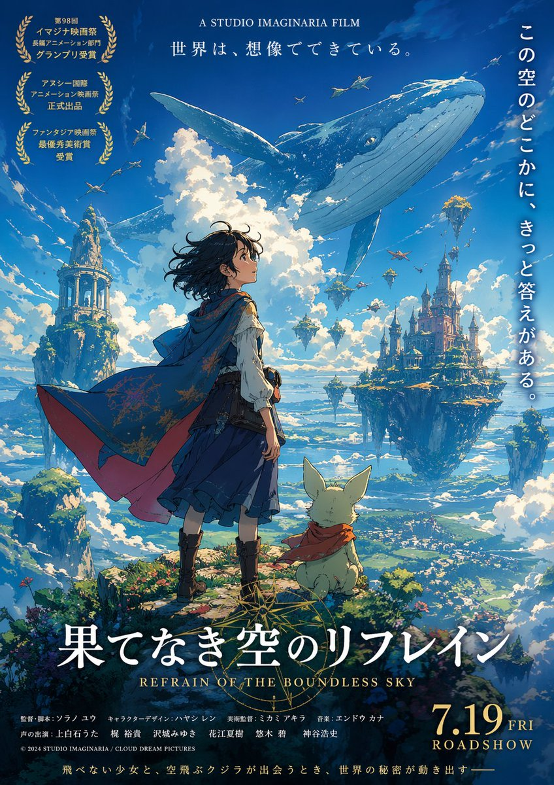
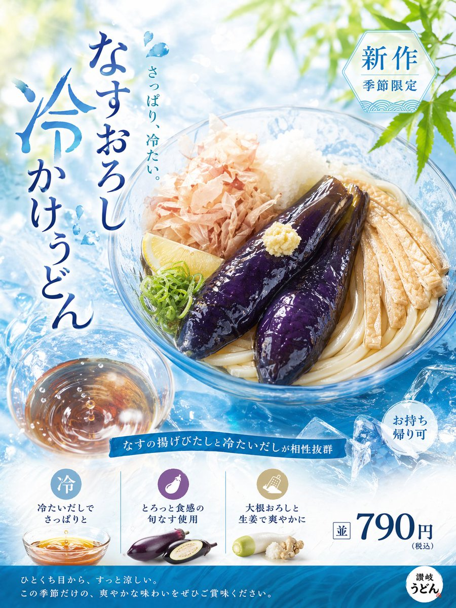
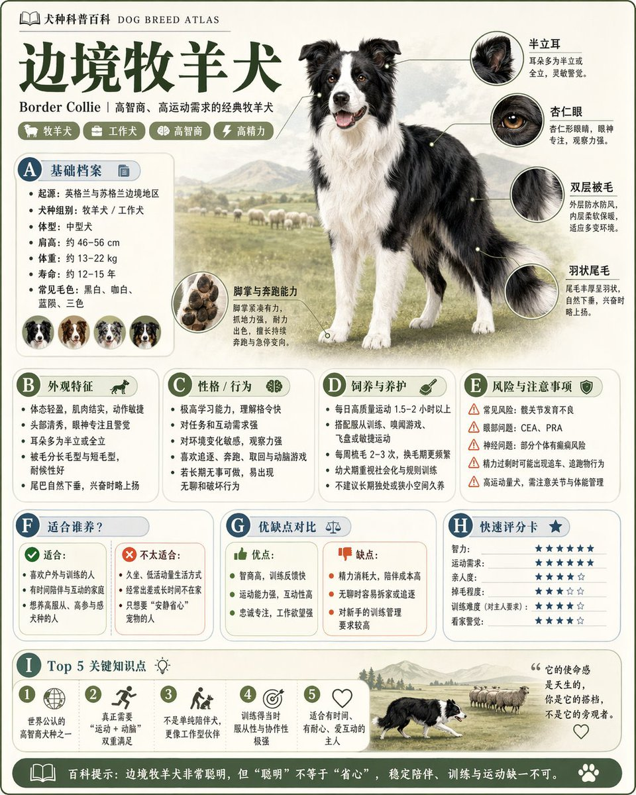

# Awesome GPT Image 2 提示词与案例库

[](https://www.gpt-image-2.dev/)
[](README.md)
[](README_zh-CN.md)

<p align="center">
  
</p>

> 一个带明确来源标注的 GPT Image 2 提示词、案例图、海报、UI mockup、社媒截图和信息图库。

如果你要找的是 GitHub 上比较完整的 GPT Image 2 prompts / examples 仓库，这个项目现在按“可追溯来源 + 按场景分类”的方式来整理。它把公开仓库里的 GPT Image 2 案例按信息图、海报、UI、产品广告、角色设定等方向拆开，并保留来源链路，避免变成一堆无法核对出处的图片堆。

这个仓库现在只保留可追溯来源的案例。之前那些主要来自站点自身、但没有明确来源链路的旧图段落已经删掉了。当前图片都来自你指定的参考仓库，或者在仓库内补了明确的上游链接。

## 快速入口

- 官网：https://www.gpt-image-2.dev/
- Gallery：https://www.gpt-image-2.dev/showcase
- Pricing：https://www.gpt-image-2.dev/pricing
- GitHub 仓库：https://github.com/aitools12/awesome-gpt-image-2
- UI 提示词页：[docs/gpt-image-2-ui-prompts.md](docs/gpt-image-2-ui-prompts.md)
- 信息图提示词页：[docs/gpt-image-2-infographic-prompts.md](docs/gpt-image-2-infographic-prompts.md)
- 海报提示词页：[docs/gpt-image-2-poster-prompts.md](docs/gpt-image-2-poster-prompts.md)
- 产品广告提示词页：[docs/gpt-image-2-product-ad-prompts.md](docs/gpt-image-2-product-ad-prompts.md)

## 仓库快照

| 指标 | 数值 |
| --- | --- |
| Prompt 模板数 | 24 |
| 带来源案例数 | 30 |
| 本地参考图 | 30 |
| 语言 | 英文、简体中文 |

主要文件：

- [`data/gpt-image-2-dev-prompts.json`](data/gpt-image-2-dev-prompts.json)
- [`data/gpt-image-2-dev-cases.json`](data/gpt-image-2-dev-cases.json)
- [`docs/gpt-image-2-ui-prompts.md`](docs/gpt-image-2-ui-prompts.md)
- [`docs/gpt-image-2-infographic-prompts.md`](docs/gpt-image-2-infographic-prompts.md)
- [`docs/gpt-image-2-poster-prompts.md`](docs/gpt-image-2-poster-prompts.md)
- [`docs/gpt-image-2-product-ad-prompts.md`](docs/gpt-image-2-product-ad-prompts.md)
- [`CONTRIBUTING.md`](CONTRIBUTING.md)
- [`PROMOTION.md`](PROMOTION.md)

## 按场景浏览 GPT Image 2 提示词

### UI Mockup 与界面图

- [GPT Image 2 UI prompts 和设计系统案例](docs/gpt-image-2-ui-prompts.md)
- 适合网页界面、移动端页面、社媒截图和视觉系统类生成

### 信息图与教育类排版

- [GPT Image 2 infographic prompts 和百科图案例](docs/gpt-image-2-infographic-prompts.md)
- 适合旅游攻略、博物馆式图解、流程图、百科卡片和说明型视觉

### 海报与编辑视觉

- [GPT Image 2 poster prompts 和宣传海报案例](docs/gpt-image-2-poster-prompts.md)
- 适合电影感海报、活动宣传、密集信息设计和封面型版式

### 产品广告与电商视觉

- [GPT Image 2 product ad prompts 和商品详情页案例](docs/gpt-image-2-product-ad-prompts.md)
- 适合电商详情页、食品广告、门店海报和品牌营销图

## 这个仓库和普通图片集合的区别

- 每个案例都保留了来源路径。
- 内容按使用场景拆页，不是单一长列表。
- 仓库内保留本地参考图，减少上游帖子失效带来的预览损坏。
- 中英文双语并行，更容易覆盖不同语言的搜索词。

## 参考仓库

- [YouMind-OpenLab/awesome-gpt-image-2](https://github.com/YouMind-OpenLab/awesome-gpt-image-2)
- [EvoLinkAI/awesome-gpt-image-2-prompts](https://github.com/EvoLinkAI/awesome-gpt-image-2-prompts)
- [ZeroLu/awesome-gpt-image](https://github.com/ZeroLu/awesome-gpt-image)

## 案例库

### 文档与信息图案例

#### 1. 手写笔记照片


```text
Amateur photo of an open notebook lying flat, filled with handwritten notes in black ballpoint pen. The handwriting is casual and slightly messy, with natural imperfections, crossed out words, underlined headings, natural daylight from a window, no flash, casual desk setting, shot on iPhone
```

来源：
- 仓库：`ZeroLu/awesome-gpt-image`
- 原始页面：https://opennana.com/awesome-prompt-gallery/black-pen-handwritten-notes
- 署名链接：https://x.com/patrickassale/status/2044569086013718958

#### 2. 景德镇青花瓷图解


```text
Create a museum-style educational infographic about Jingdezhen blue-and-white porcelain, with process steps, historical context, decorative motifs, labeled illustrations, and elegant editorial layout
```

来源：
- 仓库：`ZeroLu/awesome-gpt-image`
- 原始页面：https://opennana.com/awesome-prompt-gallery/jingdezhen-blue-white-porcelain-diagram
- 署名链接：https://x.com/joshesye/status/2045764695827562686

#### 3. 明制汉服拆解图


```text
Generate a museum-level Chinese disassembly infographic explaining the structure, materials, meanings, and dressing order of Ming dynasty Hanfu, with annotated garment parts and refined editorial composition
```

来源：
- 仓库：`ZeroLu/awesome-gpt-image`
- 原始页面：https://opennana.com/awesome-prompt-gallery/museum-level-chinese-disassembly-infographic
- 署名链接：https://x.com/MrLarus/status/2045504669401653414

#### 4. 反向传播图解海报


```text
Explain backpropagation in a clear educational poster with labeled neural network structure, forward pass, loss calculation, backward pass, gradients, and update steps
```

来源：
- 仓库：`EvoLinkAI/awesome-gpt-image-2-prompts`
- 原始帖子：https://x.com/itnavi2022/status/2046494262158930154
- 参考锚点：`Case 43: Backpropagation Diagram Poster`

#### 5. 科普百科信息图


```text
Generate a high-quality vertical encyclopedia infographic card for [topic], with one central visual, zoomed feature details, modular information blocks, concise labels, comparison cards, and collectible editorial design
```

来源：
- 仓库：`EvoLinkAI/awesome-gpt-image-2-prompts`
- 原始帖子：https://x.com/MrLarus/status/2046231542817497392
- 参考锚点：`Case 39: Science Encyclopedia Infographic`

#### 6. 城市旅游攻略信息图


```text
Generate a 3-day travel guide infographic for [city] with daily itinerary, food recommendations, landmarks, travel notes, budget summary, and social-media-friendly layout
```

来源：
- 仓库：`EvoLinkAI/awesome-gpt-image-2-prompts`
- 原始帖子：https://x.com/MrLarus/status/2046523494003851300
- 参考锚点：`Case 29: City Travel Guide Infographic`

#### 7. 书法临摹字帖


```text
Generate a calligraphy copybook practice sheet for [script style], with a title area, tracing examples, pale guide characters, structured grid boxes, and printable layout
```

来源：
- 仓库：`EvoLinkAI/awesome-gpt-image-2-prompts`
- 原始帖子：https://x.com/MrLarus/status/2046510310253539764
- 参考锚点：`Case 33: Calligraphy Copybook Sheet`

### 产品、UI 与社媒案例

#### 8. T-800 淘宝详情页


```text
Generate image: Taobao product detail page of a T-800 robot, showing front, side, and back three-view drawings of the robot, product price, product details, functions, and usage scenarios
```

来源：
- 仓库：`ZeroLu/awesome-gpt-image`
- 原始页面：https://opennana.com/awesome-prompt-gallery/terminator-taobao-page
- 署名链接：https://x.com/rionaifantasy/status/2045356799751303194

#### 9. 宇宙风 UI 设计系统


```text
Generate a UI design system in a custom cosmic style, including web pages, mobile screens, cards, controls, buttons, tags, sliders, icons, and visual elements
```

来源：
- 仓库：`ZeroLu/awesome-gpt-image`
- 原始页面：https://opennana.com/awesome-prompt-gallery/custom-style-ui-system
- 署名链接：https://x.com/stark_nico99/status/2045836554451706125

#### 10. 3D X 主页 Mockup


```text
Create a hyper-realistic 3D illustration of a slightly tilted Twitter/X profile page, keeping the original avatar, realistic UI, verification badge, follower stats, profile banner, and a person breaking out through torn paper for a strong 3D effect
```

来源：
- 仓库：`EvoLinkAI/awesome-gpt-image-2-prompts`
- 原始帖子：https://x.com/GoSailGlobal/status/2046491397424111659
- 参考锚点：`Case 30: 3D X Profile Mockup`

#### 11. 刘亦菲抖音直播截图


```text
9:16 aspect ratio, generate a screenshot of a Douyin live stream, inside is Liu Yifei live streaming, Liu Yifei is holding a sign in her hand, the sign says Tonight's live stream, welcome to join Yifei for a chat
```

来源：
- 仓库：`ZeroLu/awesome-gpt-image`
- 原始页面：https://opennana.com/awesome-prompt-gallery/liu-yifei-douyin-live-chat
- 署名链接：https://x.com/alanblogsooo/status/2044784762594918516

#### 12. 宋朝朋友圈界面


```text
Create a Song Dynasty social media feed interface with Su Dongpo posting Dongpo pork, mobile dark mode UI, literati avatar, historical humor, and modern app interaction patterns
```

来源：
- 仓库：`ZeroLu/awesome-gpt-image`
- 原始页面：https://opennana.com/awesome-prompt-gallery/song-dynasty-cyber-social-feed
- 署名链接：https://x.com/Panda20230902/status/2045385588065313057

#### 13. Apple Park 发布会随拍


```text
Amateur iPhone photo at Apple Park during the iPhone 20 keynote, Tim Cook presenting on stage, shot from the crowd at a distance
```

来源：
- 仓库：`ZeroLu/awesome-gpt-image`
- 原始页面：https://opennana.com/awesome-prompt-gallery/apple-park-tim-cook-keynote
- 署名链接：https://x.com/patrickassale/status/2044687244368441742

### 角色与结构化排版案例

#### 14. 角色设定参考页


```text
Generate an official character reference sheet with turnaround views, expression set, costume components, color palette, profile fields, and signature area
```

来源：
- 仓库：`ZeroLu/awesome-gpt-image`
- 原始页面：https://opennana.com/awesome-prompt-gallery/official-character-reference-sheet
- 署名链接：https://x.com/MANISH1027512/status/2045013913901867334

#### 15. 人物关系图海报


```text
Generate a high-design character relationship poster for [franchise or cast], with grouped factions, central protagonist, directional links, portraits, and readable map-like composition
```

来源：
- 仓库：`ZeroLu/awesome-gpt-image`
- 原始页面：https://opennana.com/awesome-prompt-gallery/key-character-relationship-map
- 署名链接：https://x.com/yihui_indie/status/2045179926270361890

## 新增 15 个带来源案例

### 16. Goldendoodle 百科卡


```text
Generate a high-quality vertical science popularization encyclopedia image based on [Theme].
```

来源：
- 仓库：`EvoLinkAI/awesome-gpt-image-2-prompts`
- 原始帖子：https://x.com/pfanis/status/2046413660147314714
- 参考锚点：`Case 32: Science Encyclopedia Vertical Poster`

### 17. AI Builder 涂鸦速写


```text
Create a doodle sketch style illustration of a powerful AI builder.
```

来源：
- 仓库：`EvoLinkAI/awesome-gpt-image-2-prompts`
- 原始帖子：https://x.com/opc_8838/status/2046162334440448339
- 参考锚点：`Case 36: AI Builder Doodle Sketch`

### 18. 架空动画电影海报



```text
Create a fictional anime movie poster with premium theatrical composition.
```

来源：
- 仓库：`EvoLinkAI/awesome-gpt-image-2-prompts`
- 原始帖子：https://x.com/seiiiiiiiiiiru/status/2046509734954741780
- 参考锚点：`Case 40: Fictional Anime Movie Poster`

### 19. 产品广告重设计


```text
Redesign this product advertisement from a professional designer perspective, aligned with current trends and target audience expectations.
```

来源：
- 仓库：`EvoLinkAI/awesome-gpt-image-2-prompts`
- 原始帖子：https://x.com/genel_ai/status/2046498264774791514
- 参考锚点：`Case 41: Product Ad Redesign`

### 20. 透明头鱼解剖百科图


```text
Create a color encyclopedia page explaining the body structure of the barreleye fish.
```

来源：
- 仓库：`EvoLinkAI/awesome-gpt-image-2-prompts`
- 原始帖子：https://x.com/itnavi2022/status/2046500429786402973
- 参考锚点：`Case 44: Barreleye Fish Anatomy Encyclopedia`

### 21. 夏季冷乌冬广告



```text
Create a seasonal ad that emphasizes freshness, moisture, and the refreshing sensation of cold udon and summer ingredients.
```

来源：
- 仓库：`EvoLinkAI/awesome-gpt-image-2-prompts`
- 原始帖子：https://x.com/genel_ai/status/2046501692246470871
- 参考锚点：`Case 46: Refreshing Summer Udon Ad`

### 22. Silicon Valley 2026 城市海报


```text
Create a refined 2026 Silicon Valley city promotional poster with an elegant future-facing atmosphere and flowing double-exposure composition.
```

来源：
- 仓库：`EvoLinkAI/awesome-gpt-image-2-prompts`
- 原始帖子：https://x.com/carsonyungos/status/2046523198116889064
- 参考锚点：`Case 48: Silicon Valley 2026 Promo Poster`

### 23. 日本超市特卖传单


```text
Generate a lively Japanese supermarket promotional flyer with strong sale typography, colorful product photos, and dense retail pricing layout.
```

来源：
- 仓库：`EvoLinkAI/awesome-gpt-image-2-prompts`
- 原始帖子：https://x.com/weel_corp/status/2046514558064586782
- 参考锚点：`Case 49: Japanese Supermarket Sale Flyer`

### 24. 普拉提工作室广告海报


```text
Create an advertising image for a pilates studio with compelling signup copy and a realistic image of a woman actively doing pilates.
```

来源：
- 仓库：`EvoLinkAI/awesome-gpt-image-2-prompts`
- 原始帖子：https://x.com/ck_igarashi/status/2046528889124728993
- 参考锚点：`Case 51: Pilates Studio Ad Poster`

### 25. 超高密度信息设计图


```text
Generate something super complex and information-dense.
```

来源：
- 仓库：`EvoLinkAI/awesome-gpt-image-2-prompts`
- 原始帖子：https://x.com/EchoraContinuum/status/2046517163826246133
- 参考锚点：`Case 52: Ultra-Dense Information Design`

### 26. 主题科普百科卡



```text
Generate a high-quality vertical encyclopedia card for [theme] with modular sections, zoomed details, rating blocks, and collectible infographic structure.
```

来源：
- 仓库：`EvoLinkAI/awesome-gpt-image-2-prompts`
- 原始帖子：https://x.com/alanlovelq/status/2046378199681257920
- 参考锚点：`Case 54: Theme Science Encyclopedia Card`

### 27. 辣椒炒肉流程图


```text
Make a detailed cooking flowchart for chili pork in a realistic style, suitable for Xiaohongshu-style infographic sharing.
```

来源：
- 仓库：`EvoLinkAI/awesome-gpt-image-2-prompts`
- 原始帖子：https://x.com/Kurt_Rousey466/status/2046267707881029934
- 参考锚点：`Case 55: Chili Pork Cooking Flowchart`

### 28. 日系抽卡界面


```text
Generate a Japanese mobile social game gacha screen.
```

来源：
- 仓库：`EvoLinkAI/awesome-gpt-image-2-prompts`
- 原始帖子：https://x.com/the_wheel_2024/status/2046519658166317160
- 参考锚点：`Case 35: Japanese Gacha Game Screen`

### 29. 马斯克抖音直播截图


```text
Create a photoreal vertical Douyin livestream screenshot where Elon Musk is speaking to camera, holding a handwritten sign, with full Chinese livestream UI and gift effects.
```

来源：
- 仓库：`EvoLinkAI/awesome-gpt-image-2-prompts`
- 原始帖子：https://x.com/Shinning1010/status/2046501587762188535
- 参考锚点：`Case 36: Elon Musk Douyin Livestream Screenshot`

### 30. 赛博霓虹 UI 设计系统


```text
Generate a futuristic cyberpunk UI design system with neon lighting, glass reflections, strong contrast, dashboards, mobile interfaces, cards, buttons, and controls.
```

来源：
- 仓库：`EvoLinkAI/awesome-gpt-image-2-prompts`
- 原始帖子：https://x.com/AZLnfvp/status/2046468976092533180
- 参考锚点：`Case 38: Cyberpunk Neon UI Design System`

## 数据文件

- [`data/gpt-image-2-dev-prompts.json`](data/gpt-image-2-dev-prompts.json)
- [`data/gpt-image-2-dev-cases.json`](data/gpt-image-2-dev-cases.json)

`cases.json` 现在已经包含来源字段，方便你后面继续扩。

## 协议

[MIT](LICENSE)
