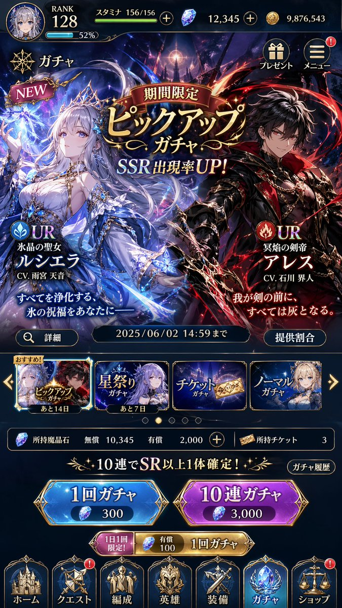

# GPT Image 2 UI Prompts and Mockup Examples

This page focuses on GPT Image 2 prompts for UI mockups, design systems, app screenshots, social feeds, and interface-style compositions. All examples link back to visible upstream sources.

## Recommended GPT Image 2 UI Prompt Patterns

- Ask for a specific platform or surface such as web dashboard, mobile app, social feed, livestream interface, or design system board.
- Specify the layout language, not just the style. Good prompts mention cards, controls, tabs, panels, labels, and visual hierarchy.
- Keep the screenshot context concrete. Device ratio, platform name, and camera angle usually improve fidelity.

## Reference Cases

### Custom Style UI Design System

Source: [ZeroLu/awesome-gpt-image](https://github.com/ZeroLu/awesome-gpt-image)  
Original page: https://opennana.com/awesome-prompt-gallery/custom-style-ui-system

### 3D X Profile Mockup

Source: [EvoLinkAI/awesome-gpt-image-2-prompts](https://github.com/EvoLinkAI/awesome-gpt-image-2-prompts)  
Original post: https://x.com/GoSailGlobal/status/2046491397424111659

### Liu Yifei Douyin Livestream Screenshot

Source: [ZeroLu/awesome-gpt-image](https://github.com/ZeroLu/awesome-gpt-image)  
Original page: https://opennana.com/awesome-prompt-gallery/liu-yifei-douyin-live-chat

### Song Dynasty Social Media Feed

Source: [ZeroLu/awesome-gpt-image](https://github.com/ZeroLu/awesome-gpt-image)  
Original page: https://opennana.com/awesome-prompt-gallery/song-dynasty-cyber-social-feed

### Japanese Gacha Game Screen

Source: [EvoLinkAI/awesome-gpt-image-2-prompts](https://github.com/EvoLinkAI/awesome-gpt-image-2-prompts)  
Original post: https://x.com/the_wheel_2024/status/2046519658166317160

### Elon Musk Douyin Livestream

Source: [EvoLinkAI/awesome-gpt-image-2-prompts](https://github.com/EvoLinkAI/awesome-gpt-image-2-prompts)  
Original post: https://x.com/Shinning1010/status/2046501587762188535

### Cyberpunk Neon UI Design System

Source: [EvoLinkAI/awesome-gpt-image-2-prompts](https://github.com/EvoLinkAI/awesome-gpt-image-2-prompts)  
Original post: https://x.com/AZLnfvp/status/2046468976092533180

## Related Pages

- [GPT Image 2 infographic prompts](gpt-image-2-infographic-prompts.md)
- [GPT Image 2 poster prompts](gpt-image-2-poster-prompts.md)
- [GPT Image 2 product ad prompts](gpt-image-2-product-ad-prompts.md)
